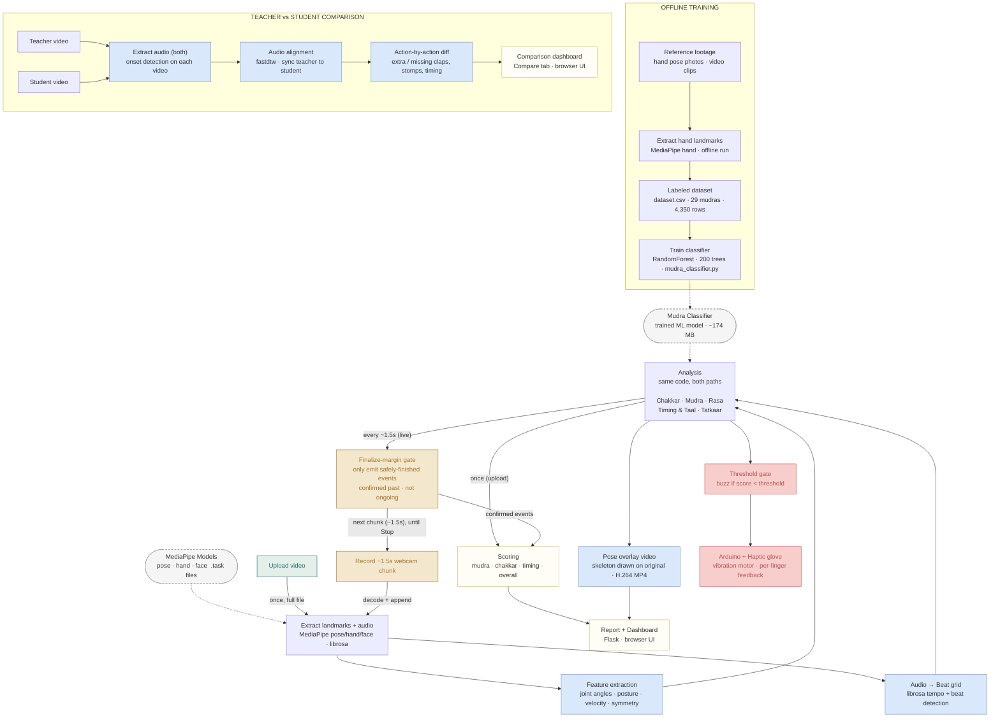

```mermaid
flowchart TD

    %% ── Offline training ──────────────────────────────────────────
    subgraph OFFLINE["OFFLINE TRAINING"]
        n20["Reference footage\nhand pose photos · video clips"]
        n21["Extract hand landmarks\nMediaPipe hand · offline run"]
        n22["Labeled dataset\ndataset.csv · 29 mudras · 4,350 rows"]
        n23["Train classifier\nRandomForest · 200 trees · mudra_classifier.py"]
        n20 --> n21 --> n22 --> n23
    end

    n31(["Mudra Classifier\ntrained ML model · ~174 MB"])
    n23 -.-> n31

    %% ── Dependencies ─────────────────────────────────────────────
    n30(["MediaPipe Models\npose · hand · face  .task files"])

    %% ── Inputs ────────────────────────────────────────────────────
    n40["Upload video"]
    n41["Record ~1.5s webcam chunk"]

    %% ── Core pipeline ─────────────────────────────────────────────
    n50["Extract landmarks + audio\nMediaPipe pose/hand/face · librosa"]
    n51["Feature extraction\njoint angles · posture · velocity · symmetry"]
    n52["Audio → Beat grid\nlibrosa tempo + beat detection"]

    n53["Analysis\nsame code, both paths\n\nChakkar · Mudra · Rasa\nTiming & Taal · Tatkaar"]

    n54["Scoring\nmudra · chakkar · timing · overall"]
    n55["Pose overlay video\nskeleton drawn on original · H.264 MP4"]
    n56["Finalize-margin gate\nonly emit safely-finished events\nconfirmed past · not ongoing"]
    n57["Report + Dashboard\nFlask · browser UI"]

    n58["Threshold gate\nbuzz if score < threshold"]
    n59["Arduino + Haptic glove\nvibration motor · per-finger feedback"]

    %% ── Connections ───────────────────────────────────────────────
    n30 -.-> n50
    n31 -.-> n53

    n40 -->|"once, full file"| n50
    n41 -->|"decode + append"| n50

    n50 --> n51
    n50 --> n52
    n51 --> n53
    n52 --> n53

    n53 -->|"once (upload)"| n54
    n53 --> n55
    n53 -->|"every ~1.5s (live)"| n56
    n53 --> n58

    n56 -->|"confirmed events"| n54
    n56 -->|"next chunk (~1.5s), until Stop"| n41

    n54 --> n57
    n55 --> n57
    n58 --> n59

    %% ── Teacher vs Student comparison ────────────────────────────
    subgraph COMPARE["TEACHER vs STUDENT COMPARISON"]
        n70["Teacher video"]
        n71["Student video"]
        n72["Extract audio (both)\nonset detection on each video"]
        n73["Audio alignment\nfastdtw · sync teacher to student"]
        n74["Action-by-action diff\nextra / missing claps, stomps, timing"]
        n75["Comparison dashboard\nCompare tab · browser UI"]
        n70 --> n72
        n71 --> n72
        n72 --> n73 --> n74 --> n75
    end

    %% ── Styles ────────────────────────────────────────────────────
    classDef upload fill:#E4EFEA,stroke:#1B6E67,color:#1B6E67
    classDef live   fill:#F3E7CE,stroke:#A8752B,color:#A8752B
    classDef dep    fill:#f5f5f5,stroke:#999,color:#333,stroke-dasharray:4 4
    classDef newnode fill:#dae8fc,stroke:#6c8ebf,color:#333
    classDef score  fill:#FFFDF6,stroke:#C9B77E,color:#333
    classDef hw     fill:#f8cecc,stroke:#b85450,color:#b85450

    class n40 upload
    class n41,n56 live
    class n30,n31 dep
    class n51,n52,n55,n72,n73,n74 newnode
    class n54,n57,n75 score
    class n58,n59 hw
```
