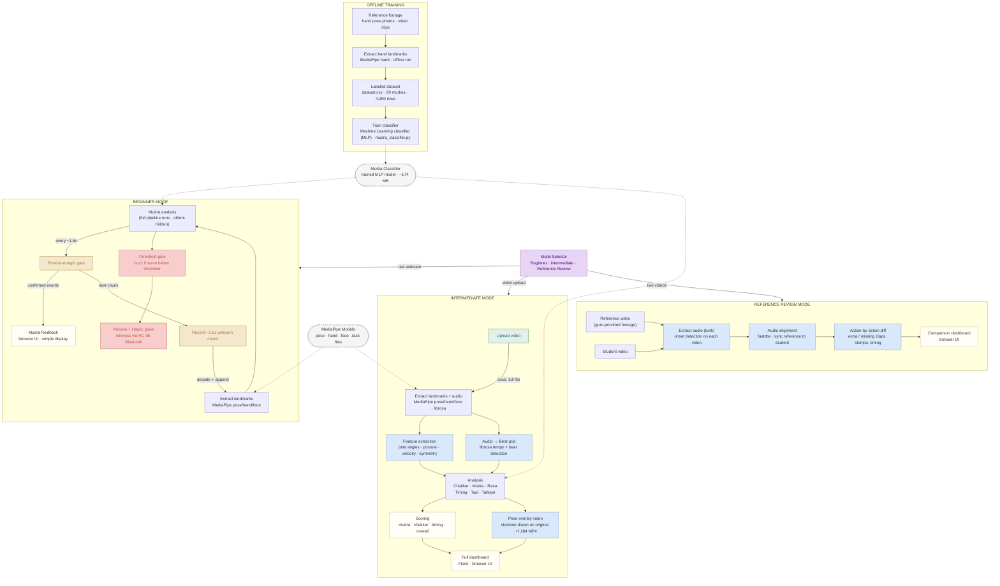

```mermaid
flowchart TD

    %% ── Offline training ──────────────────────────────────────────
    subgraph OFFLINE["OFFLINE TRAINING"]
        n20["Reference footage\nhand pose photos · video clips"] --> n21["Extract hand landmarks\nMediaPipe hand · offline run"] --> n22["Labeled dataset\ndataset.csv · 29 mudras · 4,350 rows"] --> n23["Train classifier\nMachine Learning classifier (MLP) · mudra_classifier.py"]
    end

    n31(["Mudra Classifier\ntrained MLP model · ~174 MB"])
    n23 -.-> n31

    n30(["MediaPipe Models\npose · hand · face  .task files"])

    %% ── Mode selector ─────────────────────────────────────────────
    n00["Mode Selector\nBeginner · Intermediate · Reference Review"]

    %% ── BEGINNER MODE ─────────────────────────────────────────────
    subgraph BEGINNER["BEGINNER MODE"]
        n41["Record ~1.5s webcam chunk"]
        n50b["Extract landmarks\nMediaPipe pose/hand/face"]
        n53b["Mudra analysis\n(full pipeline runs · others hidden)"]
        n56b["Finalize-margin gate"]
        n57b["Mudra feedback\nbrowser UI · simple display"]
        n58b["Threshold gate\nbuzz if score below threshold"]
        n59b["Arduino + Haptic glove\nwireless via HC-05 Bluetooth"]
        n41 -->|"decode + append"| n50b
        n50b --> n53b
        n53b -->|"every ~1.5s"| n56b
        n53b --> n58b
        n56b -->|"confirmed events"| n57b
        n56b -->|"next chunk"| n41
        n58b --> n59b
    end

    %% ── INTERMEDIATE MODE ─────────────────────────────────────────
    subgraph INTERMEDIATE["INTERMEDIATE MODE"]
        n40["Upload video"]
        n50i["Extract landmarks + audio\nMediaPipe pose/hand/face · librosa"]
        n51i["Feature extraction\njoint angles · posture · velocity · symmetry"]
        n52i["Audio → Beat grid\nlibrosa tempo + beat detection"]
        n53i["Analysis\nChakkar · Mudra · Rasa\nTiming · Taal · Tatkaar"]
        n54i["Scoring\nmudra · chakkar · timing · overall"]
        n55i["Pose overlay video\nskeleton drawn on original · H.264 MP4"]
        n57i["Full dashboard\nFlask · browser UI"]
        n40 -->|"once, full file"| n50i
        n50i --> n51i
        n50i --> n52i
        n51i --> n53i
        n52i --> n53i
        n53i --> n54i
        n53i --> n55i
        n54i --> n57i
        n55i --> n57i
    end

    %% ── REFERENCE REVIEW MODE ─────────────────────────────────────
    subgraph REFERENCE["REFERENCE REVIEW MODE"]
        n70["Reference video\n(guru-provided footage)"]
        n71["Student video"]
        n72["Extract audio (both)\nonset detection on each video"]
        n73["Audio alignment\nfastdtw · sync reference to student"]
        n74["Action-by-action diff\nextra / missing claps, stomps, timing"]
        n75["Comparison dashboard\nbrowser UI"]
        n70 --> n72
        n71 --> n72
        n72 --> n73 --> n74 --> n75
    end

    %% ── Shared dependencies ───────────────────────────────────────
    n30 -.-> n50b
    n30 -.-> n50i
    n31 -.-> n53b
    n31 -.-> n53i

    n00 -->|"live webcam"| BEGINNER
    n00 -->|"video upload"| INTERMEDIATE
    n00 -->|"two videos"| REFERENCE

    %% ── Styles ────────────────────────────────────────────────────
    classDef upload fill:#E4EFEA,stroke:#1B6E67,color:#1B6E67
    classDef live   fill:#F3E7CE,stroke:#A8752B,color:#A8752B
    classDef dep    fill:#f5f5f5,stroke:#999,color:#333,stroke-dasharray:4 4
    classDef newnode fill:#dae8fc,stroke:#6c8ebf,color:#333
    classDef score  fill:#FFFDF6,stroke:#C9B77E,color:#333
    classDef hw     fill:#f8cecc,stroke:#b85450,color:#b85450
    classDef mode   fill:#e8d5f5,stroke:#7b4fa6,color:#4a0080

    class n40 upload
    class n41,n56b live
    class n30,n31 dep
    class n51i,n52i,n55i,n72,n73,n74 newnode
    class n54i,n57i,n75,n57b score
    class n58b,n59b hw
    class n00 mode
```
